# transformer-build-notes

Notes based on my personal experience working through Stanford CS336's Assignment 1 (Basics). Reflects my own learning process, not official course content or solutions.

## 1. Tokenizer

#### 1.1 Why do we need Tokenizer

- Serves as the tool that converts natural language into a machine-readable representation the model can process.
- Converts the machine-generated representation back into natural language to present the result to the user.
- Must satisfy a **hard structural constraint of the model** — a fixed vocabulary size, since it directly determines the dimensions of the transformer's embedding matrix and the softmax output layer. At the same time, for **computational efficiency**, the tokenizer must go further than simply having a finite vocabulary: it needs to compress the same content into as few tokens as possible, which is what distinguishes it from plain character-level tokenization.

#### 1.2 Steps to build a Tokenizer

##### 1.2.1 Questions before starting

- **Input-format problems** — practical/engineering constraints unrelated to meaning, e.g. text being too long to feed into the model as a single input at once.
- **Semantic-boundary problems** — how to handle characters that carry no semantic content but serve a structural role in text (e.g. punctuation, line breaks); and more generally, where to draw the boundary of a "unit" when raw text is just a continuous stream of characters — if the boundary is drawn inconsistently, the same word could end up encoded differently depending on context.
- **Vocabulary-design problems** — how to map an unbounded space of possible text onto a finite, fixed set of tokens; and specifically, how to guarantee that words or characters never seen during vocabulary construction can still be encoded losslessly at inference time, without errors or missing information.
- **Efficiency problems** — distinct from the "sequence-length efficiency" discussed in the why section (which is about the quality of the output), this is about the runtime efficiency of the encoding process itself: how to design the vocabulary-construction/merging algorithm so it still finishes in reasonable time on large-scale corpora.

##### 1.2.2 Why BPE

Byte pair encoding (BPE) is a data compression and tokenization algorithm that iteratively merges the **most frequent pairs** of bytes or subwords in a text sequence

- Working process:
<div align="center">
  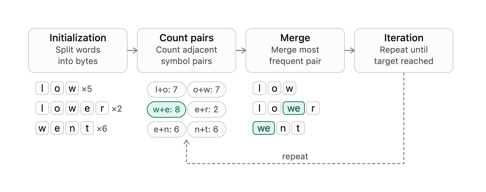
  <p>Figure 1: BPE Algorithm steps</p>
</div>

- Reasons:

  - Because the algorithm repeatedly merges symbol pairs based on their frequency, this mechanism naturally produces a behavior where common words are kept intact as whole tokens while rare words get broken down into finer subword units. This behavior happens to sidestep the problems of both character-level and word-level tokenization at once.
  - BPE's vocabulary isn't defined by hand-crafted rules — it's learned entirely from the statistical frequencies observed in the training corpus. This means it automatically adapts to the statistical distribution of whatever corpus it's trained on, whether that's a different language or a different domain.
  - The byte-level fallback guarantee means that no matter how far subword merging progresses, the worst case always degrades gracefully to a byte-by-byte representation — this is precisely the mechanism that makes the out-of-vocabulary avoidance actually work.

##### 1.2.3 Preparations

- **Preparation 1. Streaming read & Buffering**
  - To address the "input text is too long to feed in all at once" problem, `encode_iterable` reads the input as a stream instead of loading the entire file into memory and encoding it in one shot. It maintains a fixed-size buffer (roughly 4096 characters): it keeps appending incoming pieces of text to the buffer, and once the buffer is full, it encodes that chunk and immediately yields the resulting ids before moving on to accumulate the next chunk. This way, no matter how large the input file is, only **a small buffer needs to stay in memory** at any given time — never the whole file.
  - The cutoff point for the buffer can't be arbitrary, though: if the buffer happens to be cut off in the middle of a word or in the middle of a special token, that word or token would incorrectly get split across two separate encoding calls, corrupting the result. So once the buffer reaches its target length, the code checks whether the last character is a letter, a digit, or a prefix fragment of a special token — if so, it keeps extending the buffer further until **it reaches a safe boundary to cut at.**
  - To achieve this "read a chunk, encode it, yield it" behavior, `encode_iterable` uses `yield from` to emit the token ids produced from each buffer chunk one at a time, rather than accumulating everything into one large list and returning it all at once — this lets the **caller start consuming results while the rest of the file is still being processed.**
  - At the level above, `create_token_id` also wraps its call to `encode_iterable` in a `yield from`. The purpose here is different: it isn't about producing ids one at a time (that's already handled inside `encode_iterable`) — it's about making `create_token_id` itself a lazily-evaluated generator, so that the setup work inside it (such as constructing the `Tokenizer`) only **actually runs once something downstream starts pulling values** (for example, the first internal `next()` call inside `np.fromiter`), rather than running immediately the moment `create_token_id(...)` is called.
<div align="center">
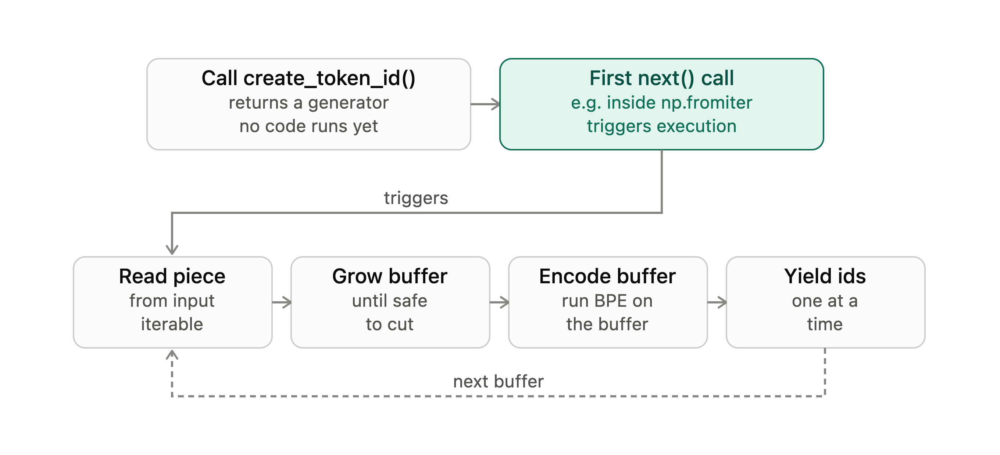
<p>Figure 2: Streaming buffer and lazy generator</p>
</div>

- **Preparation 2: Handling semantic boundaries (special tokens and pre-tokenization)**

  To address the problem of "which characters carry a structural function and need to be treated differently from ordinary semantic content," this step operates on two separate layers, each drawing boundaries at a different granularity.

  -  The first layer is **splitting on special tokens**. Text may contain structural markers like `<|endoftext|>`, which carry no semantic meaning at all — they simply mark document or section boundaries — and must therefore be identified as whole, indivisible units before anything else happens, rather than being swept into the byte-merging process. There's a subtlety here that's easy to overlook: when multiple special tokens are present, matching must **prioritize the longest one first**. The reason is that if one special token happens to be a prefix of another, longer special token, matching the shorter one first would incorrectly split the longer token into "the short token plus a leftover fragment," with that leftover then treated as ordinary text — completely destroying the integrity of the longer special token. To prevent this, all special tokens are sorted by length, longest first, before building the matching pattern, so that the more specific, longer match always takes precedence.
  -  The second layer is pre-tokenization. Before handing a stretch of ordinary text (whatever remains after special-token splitting) off to **byte-level merging**, **a set of regex rules first roughly segments it into candidate units** — broadly corresponding to words, runs of digits, runs of punctuation, and runs of whitespace. The purpose of this layer is to define the scope within which byte merging is allowed to happen: merges can only occur inside a single pre-token, never across a pre-token boundary. This prevents a word from accidentally getting merged together with the punctuation that follows it into one inseparable unit, which in turn guarantees that the same word is encoded consistently regardless of what surrounds it in a given context.

- **Preparation 3: Vocabulary construction and efficient lookup (BPE training and index design)**

  This step addresses two categories of problem at once: the vocabulary-design problem (how to map an unbounded space of text onto a finite, fixed-size vocabulary) and the efficiency problem (how to make that construction process finish in reasonable time on a large-scale corpus).

  -  The overall idea behind building the vocabulary is "start from the smallest units, then repeatedly merge by statistical frequency." First, every word in the corpus is not handled as a string at all — it's **converted into a tuple of individual bytes**. The reason for starting from single bytes is that the 256 byte values form a naturally finite set that can nonetheless cover any Unicode text, which is what fundamentally guarantees that any input can be represented no matter what.
  -  On top of that, the construction process maintains three interrelated data structures: `byte_words` records each byte tuple and how often it occurs in the corpus; `pair_frequent_table` records the total weighted frequency of every adjacent byte pair; and `reverse_index_table` records, for each byte pair, which byte tuples contain it. The first two are statistics; the third is a reverse index — extra space deliberately spent in exchange for speed.
  -  Each merge round proceeds as follows: take the highest-frequency byte pair from `pair_frequent_table`, then use `reverse_index_table` to jump straight to the words containing that pair, and for each such word perform the merge while updating all three structures in step. In `byte_words`, the old tuple key is deleted and the merged tuple is inserted as a new key. In `pair_frequent_table`, the pairs that previously sat on either side of the merge point — along with the merged pair itself — have this word's frequency subtracted, while the pairs newly formed around the merged token have that frequency added. In `reverse_index_table`, the old tuple is removed from the sets of all its old byte pairs, and the new tuple is added to the sets of all its new byte pairs. Every byte pair that was touched is recorded, so that once the round finishes, entries whose count dropped to zero and entries whose word set became empty can be cleaned up in one pass. This whole process repeats until the vocabulary reaches its target size.
<div align="center">
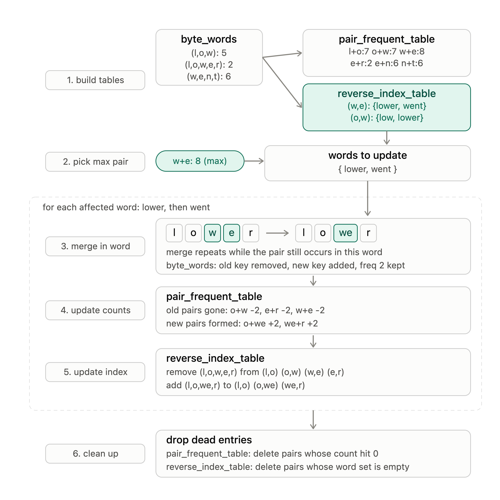
<p>Figure 3: BPE merge full pipeline</p>
</div>

##### 1.2.4 Construction

This section is about how the building blocks prepared earlier get organized into three sequential steps that ultimately turn a piece of raw text into a token id sequence ready to feed into the transformer. The three steps are strictly chained — each one's output is exactly the next one's input.

- **Step 1: BPE Training** — takes `input_path`, `vocab_size`, and `special_tokens` as input, and internally runs the full loop described in Preparation 3 ("find the highest-frequency pair → locate the affected words via the reverse index → merge and update the three tables") repeatedly until the vocabulary reaches its target size. This step produces two files: `vocab.json` and the `merges` file — the only two things needed to construct the tokenizer in the next step.

  **Note**: the number of merge operations to run equals `vocab_size` minus the size of the initial vocabulary (`num_init_words`), where the initial vocabulary is the 256 possible byte values plus the number of special tokens

- **Step 2: Building the Tokenizer** — `Tokenizer.from_files` reads in the two files produced by step 1 directly, and constructs the internal state: `vocab`, `vocab_reverse`, and `merges_dict` (this last one is exactly the "pay a one-time preprocessing cost for constant-time lookup later" optimization mentioned at the end of Preparation 3). Once constructed, this `Tokenizer` object exposes three methods with a clear calling relationship between them: `encode` is the core method, internally following the chain from Preparation 2 — "split on special tokens → pre-tokenization → byte-level merging"; `encode_iterable` wraps `encode` with the streaming-buffer logic from Preparation 1, calling `encode` once every time a safe-to-cut buffer chunk has accumulated; and `decode` is simply the inverse of `encode`, turning a token id sequence back into text. The output of this step is a fully functional `Tokenizer` object capable of both encoding and decoding.

- **Step 3: Generating token_ids** — `create_token_id` wraps the `Tokenizer` object from step 2, calling its `encode_iterable`, and itself uses `yield from` to stay fully lazy (matching the design from Preparation 1: nothing executes at call time, everything is deferred until values are actually pulled). The output of this step is a token id generator that can be fed directly into `np.fromiter`, ultimately written out as a `uint16` binary file — this is the endpoint of the entire tokenizer pipeline, and it's exactly the input data that gets read when training the transformer.

## 2. Transformer

#### 2.1 Why do we need Transformer

##### 2.1.1 Background

- A language model's core task is next-token prediction: given a sequence of tokens, predict what comes next.
- This task itself is architecture-agnostic — before Transformers, it was handled mainly by RNNs (and later their gated variants, LSTM and GRU).
- Understanding why Transformers replaced RNNs requires first understanding the structural limitations that RNNs' processing method introduces.

##### 2.1.2 Problems with RNNs

- RNNs process sequences step by step: computing the hidden state at position t requires the hidden state at position t-1 to already be finished — no step can be skipped.
- At each step, newly read information is squeezed into the same fixed-size hidden state vector, blending it with everything that came before.
- This creates two distinct problems:
  - Vanishing gradients: during backpropagation, the gradient must pass through as many multiplicative steps as there are positions between two tokens. If each step's derivative has magnitude less than 1, the gradient shrinks exponentially with distance, making it hard for RNNs to learn relationships between far-apart tokens.
  - An information bottleneck: independent of training, all historical information must be compressed into the same fixed-dimension vector no matter how long the sequence gets, so earlier information is inevitably overwritten and diluted by later compression steps.

##### 2.1.3 How Transformers solve both problems

- Self-attention lets every position in the sequence keep its own representation independently, rather than forcing it into one shared vector.
- Any two positions, no matter how far apart, can establish a direct connection in a single step, retrieving each other's original representation without passing through intermediate positions.
  - This sidesteps the vanishing-gradient problem, since there's no long multiplicative chain to shrink through.
  - It also sidesteps the information-bottleneck problem, since nothing is repeatedly compressed and overwritten.
- Because the computation for every position (self-attention and every other layer) is a matrix operation performed simultaneously, with no "must wait for the previous position" dependency, the entire computation can be fully parallelized — training speed is no longer locked to sequence length, and more parallel compute directly translates into faster training.
<div align="center">
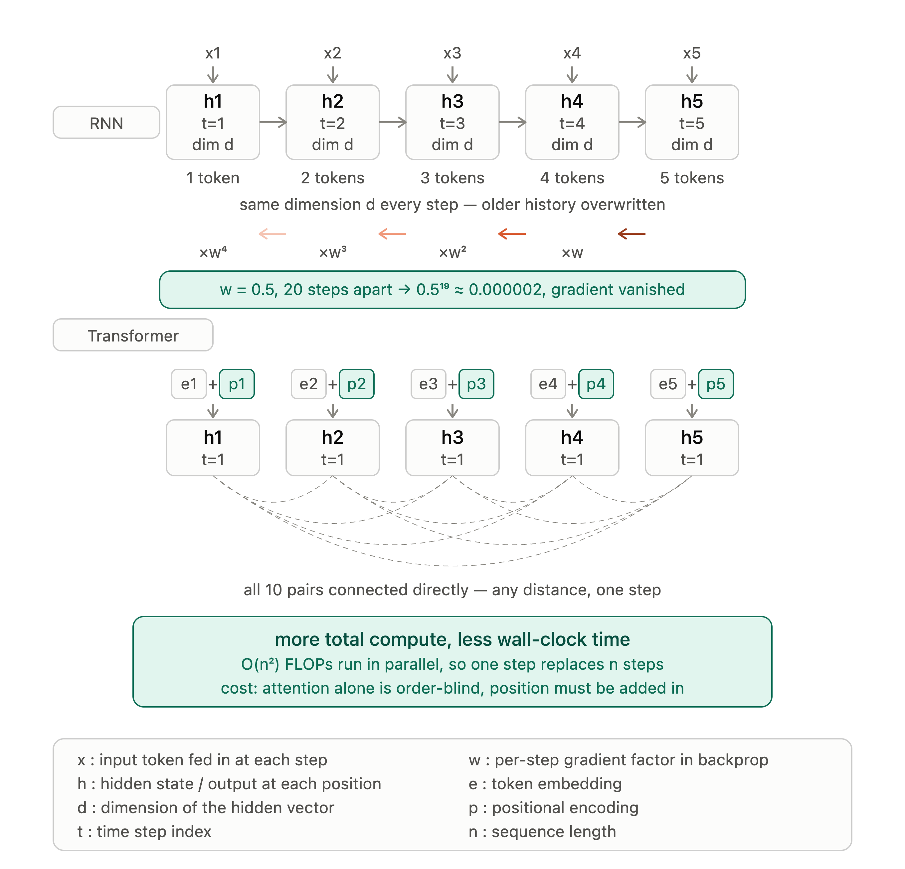
<p>Figure 4: RNN vs Transformer comparison</p>
</div>
#### 2.2 Steps to build a Transformer
<div align="center">
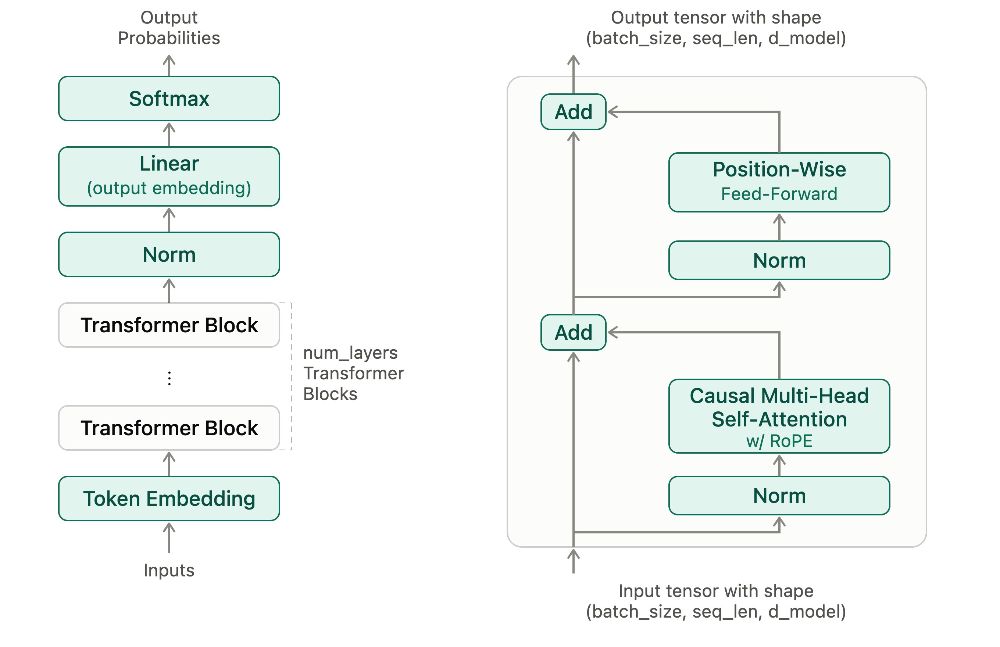
<p>Figure 5: Transformer architecture & A pre-norm Transformer block</p>
</div>
##### 2.2.1 Questions before starting

- **On Embedding**
  - Why do discrete token ids need to be converted into vectors at all, rather than feeding the raw integer id directly into the rest of the network?
  - Why must the resulting vector's dimension, `d_model`, match the dimension used throughout attention and the FFN?
- **On Attention**
  - When predicting token t, why can't the model see token t+1 and beyond — what problem does the causal mask solve
  - Why multi-head attention, rather than one larger single-head attention doing the same job?
  - Self-attention itself is order-blind (as established in section 2.1) — specifically how does RoPE put that ordering information back in?
- **On Norm**
  - Why do deep networks need normalization at all? What training problem would show up if you simply stacked many layers of attention and FFN without it?
  - Why is Norm applied separately before each sub-layer (attention, FFN), rather than once for the whole block?
  - Why pre-norm (norm, then enter the sub-layer) rather than post-norm (enter the sub-layer, then norm)?
- **On the FFN**
  - Attention lets information flow between different positions — so what handles further processing of a single position's own information?
  - Why does an FFN have to follow attention, and what's the division of labor between the two?
- **On stacking layers**
  - Why stack many attention+FFN blocks, rather than making a single block large enough (bigger `d_model` or `d_ff`) to achieve the same effect?
  - What has to be true for a stack this deep to even be trainable in the first place — this ties back to the point in section 2.1 that residual connections are what solve vanishing gradients?
- **On the final output**
  - What form does the task of next-token prediction itself demand as output — why must it be a probability distribution rather than a single, definite token?
  - Specifically, how does softmax satisfy that "must be a probability distribution" requirement?

##### 2.2.2 PyTorch basic

- **Tensor creation & shape operations**
<div align="center">
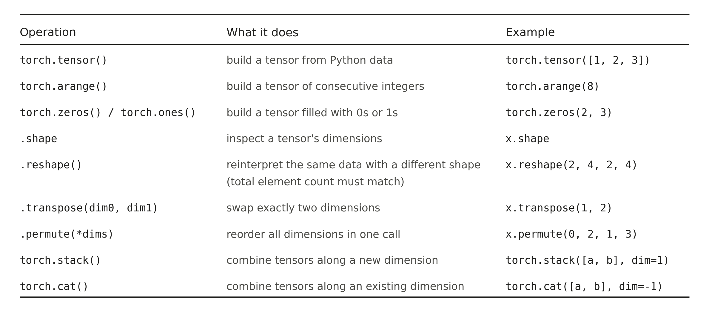
<p>Figure 6: Common tensor creation and shape operations in pytorch</p>
</div>
<div align="center">
​	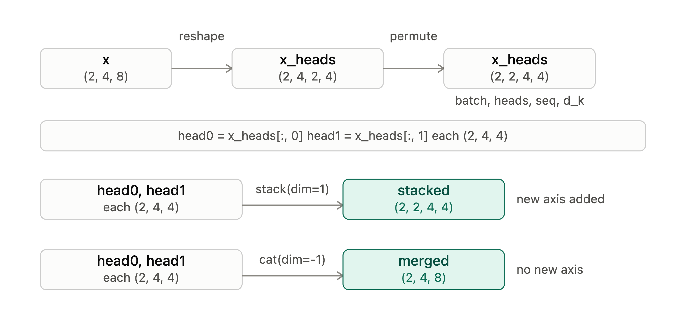
<p>Figure 7: Tensor shape operations diagram</p>
</div>

- **Elementwise operations, reduction & broadcasting**

  Three different kinds of operations get combined constantly in tensor code, and it's worth being able to tell them apart at a glance. An **elementwise** operation (`x**2`, `torch.sqrt(...)`, `+`) applies the same computation to every entry independently and never changes the tensor's shape. A **reduction** (`.mean()`, `.sum()`, `.max()`, usually called with a `dim=` argument) collapses one or more dimensions down into a single value per remaining slice, which does change the shape. **Broadcasting** is the rule that lets tensors of *different* shapes still be combined elementwise, by implicitly stretching any dimension of size 1 to match its counterpart — without broadcasting, every operation would require both tensors to already have identical shapes.

  A single line from RMSNorm shows all three working together:

  ```python
  RMS_a = torch.sqrt((x**2).mean(dim=-1, keepdim=True) + self.eps)
  ```

  `x**2` is elementwise, so it leaves the shape untouched. `.mean(dim=-1, keepdim=True)` is a reduction along the last dimension — this is where `d_model` disappears into a single averaged value per token. `+ self.eps` and `torch.sqrt(...)` are elementwise again, so the shape settles once `.mean()` has done its work and doesn't change after that.
<div align="center">
  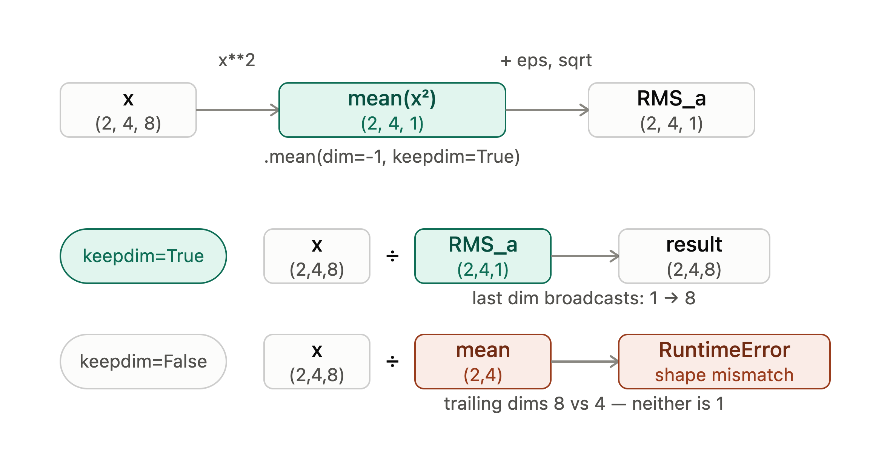
<p>Figure 8: RMSNorm shape broadcast diagram</p>
</div>
- **Matrix / tensor multiplication**

  `einsum` isn't something PyTorch invented — it comes from Einstein summation notation, and NumPy, native PyTorch (`torch.einsum`), and the `einops` library each provide their own implementation. Here we're using `einops`'s version, whose main difference from PyTorch's native one is readability: the native version labels dimensions with single letters (e.g. `"bhqd,bhkd->bhqk"`), while `einops` lets you label each dimension with a meaningful name instead (e.g. `"batch heads query d_k, batch heads key d_k -> batch heads query key"`), so you're not forced to keep a mental lookup table of what each letter means.

  The problem `einsum` solves is this: whenever a matrix multiplication has to juggle several dimensions at once — some are "batch" dimensions that both sides keep untouched (like `batch`, `heads`), some are dimensions that get multiplied together and summed away (like `d_k`), and some belong to only one side but need to survive into the output (the query and key positions) — expressing that with plain `matmul` gets clunky fast, usually requiring you to manually `transpose`/`permute` things into alignment first. `einsum` lets you just write down what the inputs look like and what the output should look like, and it works out the alignment and summation for you.

  Here's what that looks like in code:

  ```python
  from einops import einsum
  
  # Q: (batch, heads, query, d_k)
  # K: (batch, heads, key,   d_k)
  scores = einsum(
      Q, K,
      "batch heads query d_k, batch heads key d_k -> batch heads query key"
  )
  # scores: (batch, heads, query, key)
  ```

  The two halves before the arrow, separated by a comma, list the dimension names for `Q` and `K` respectively; the part after the arrow lists the dimension names of the output. `batch` and `heads` appear in both inputs and the output, so they're carried through unchanged. `query` belongs only to `Q`, `key` belongs only to `K`, and each survives into the output. Only `d_k` appears in both inputs but not after the arrow — that's the dimension that gets multiplied and summed away, which is exactly where the inner product of matrix multiplication happens.

  The diagram lays this out as a grid: one column per dimension name, one row per tensor. `Q`'s row has cells under `batch`, `heads`, `query`, and `d_k`, but nothing under `key`, since `Q` has no such axis. `K`'s row has cells under `batch`, `heads`, `key`, and `d_k`, but nothing under `query`. The `scores` row has cells under `batch`, `heads`, `query`, and `key` — and nothing under `d_k`, since that's the one dimension that didn't make it into the output.
<div align="center">
  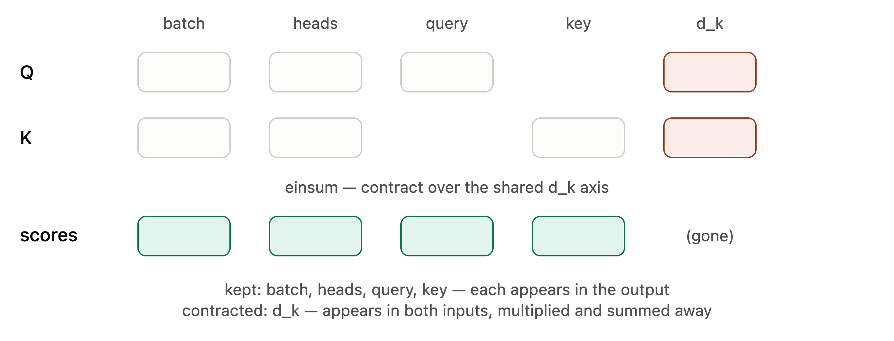
<p>Figure 9: Einsum explanation diagram</p>
</div>
##### 2.2.3 Preparations

- **Embedding**

  The input token id sequence goes through an embedding weight matrix **(vocab_size, d_model)** via a lookup: each position's token id is used as a row index to retrieve the corresponding row vector. After doing this for the whole batch, the shape changes from **(batch_size, context_length)** to **(batch_size, context_length, d_model)**.

  One point worth adding here: why must every token's representation have exactly dimension dmodeld_{\text{model}} dmodel, rather than some arbitrary size? The answer lies in the residual connection. Every later layer performs
  $$
  x_{l+1} = x_l + F_l(x_l)
  $$
  and this addition requires $x_l$ and $F_l(x)$ to have identical shapes. If the embedding output's dimension didn't match the dimension used internally/output by attention and the FFN, this residual addition would be impossible from the very first layer. So d_model is really a dimension enforced consistently across the entire network by the residual connections.
<div align="center">
  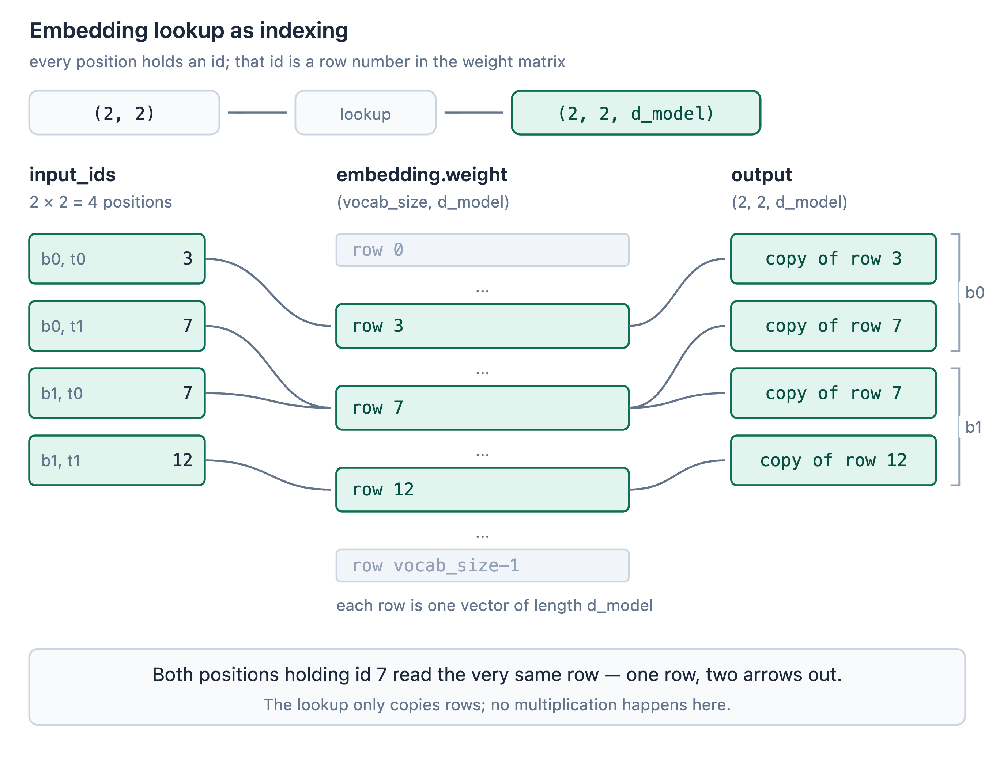
<p>Figure 9: Embedding loopup diagram</p>
</div>

- **Attention (causal mask / multi-head / RoPE)**

  *Causal mask*: during training the model processes the whole sequence in parallel — when computing attention for position $t$, without a mask it could directly see information from positions $\dots t+1,t+2,….$ But the training objective is precisely to predict token $t+1$ from the first  $t$ tokens; if the model can see the answer directly, this "prediction" is meaningless — the model just learns to copy rather than to predict. More importantly, this training setup would be inconsistent with real inference: at inference time, generation is autoregressive, one token at a time, and when generating token $t+1$, token $t+2$ doesn't exist yet. So the causal mask is fundamentally about making the training-time computation match the information that's actually available at inference time.

  *Multi-head*: a single attention head, for a given query, can only use one fixed set of weights $W_Q, W_K, W_V$  to measure "relevance to other tokens" — all information gets compressed into one shared attention distribution. Multi-head lets the model learn hh h independent sets of $(W_Q^{(i)}, W_K^{(i)}, W_V^{(i)})$  at once, each capturing a different relational pattern in its own subspace (e.g., one head might lean toward local syntactic relationships, another toward long-range semantic ones); the $h$ heads' outputs are then concatenated and passed through a linear layer to fuse them. This is an increase in representational capacity, not a vague increase in "possibilities."

  *RoPE*: the core benefit of RoPE isn't reducing the computational cost of the dot product itself (a dot product between two dd d-dimensional vectors costs $O(d)$ regardless of RoPE). Rather, it gives the dot product a special property — relative-position invariance. Specifically, if the query vector at position $m$ and the key vector at position $n$ are each rotated by an angle depending on their own position before the dot product, the result depends only on the relative distance $m−n$:
  $$
  \langle R_m q, R_n k \rangle = g(q, k, m-n)
  $$
  In other words, the rotation angle is a function of the position index — position $m$ determines how much to rotate — and this is precisely the mechanism by which positional information gets encoded into the vector itself. This way, the relative-position relationship between any two positions naturally shows up in a single dot product, without needing a separate absolute position vector added in beforehand.
<div align="center">
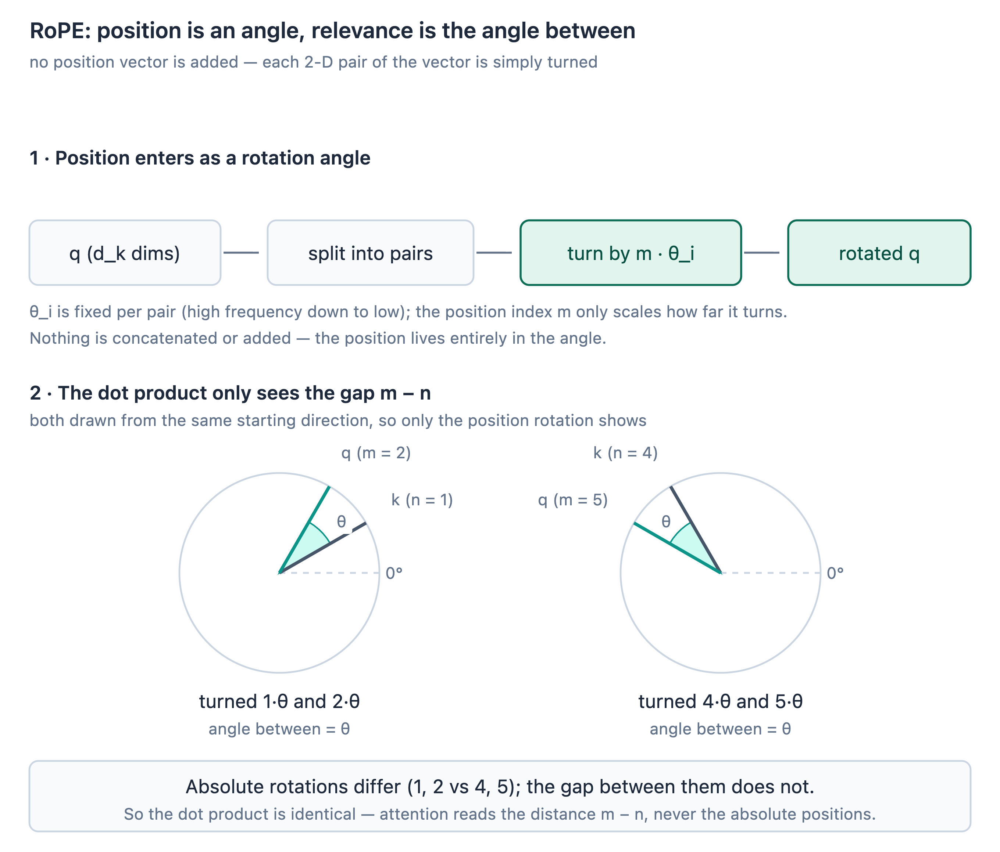
<p>Figure 10: RoPE rotation relative position diagram</p>
</div>
- **Norm**

  Whether after attention or after the FFN, the residual connection：
  $$
  x_{l+1} = x_l + F_l(x_l)
  $$
  causes the numerical scale to keep accumulating — the addition itself does nothing to control scale. If the scale grows too large or too small across layers, it directly affects the next computation: for example, when scale is too large going into $QK⊤,$ softmax becomes very sharp (close to one-hot) and gradients nearly vanish; unstable scale also causes step-to-step update magnitudes to swing unpredictably. So before entering the next "big transformation" (attention or FFN), normalization recalibrates the scale. Take RMSNorm as an example:
  $$
  \text{RMS}(x) = \sqrt{\frac{1}{d}\sum_{i=1}^{d} x_i^2 + \epsilon}, \qquad \hat{x} = \frac{x}{\text{RMS}(x)} \cdot g
  $$
  This normalizes only over the last dimension (**d_model)**, pulling each token's own vector back into a stable scale, independent of other samples in the batch or other positions in the sequence.

  One detail worth being precise about: dividing by $RMS(x)$ only fixes the ***scale*** of the vector — it forces every feature to land in roughly the same numeric range. But it says nothing about whether that particular scale is the right one for what the network needs to represent at that point. If normalization simply clamped everything to unit RMS with no way to undo or adjust that clamp, it would be actively throwing away information the model might need — some channels may need to carry more weight than others after normalization, and a fixed normalization has no way to express that.

  This is what the gain parameter $g$ is for. It's a learnable vector of shape **(d_model,)**— one scalar per feature channel, not a single global scalar — that gets multiplied elementwise into the normalized output.

- **FFN**

  What attention does is information exchange: each token "pulls" information from other tokens based on relevance. But the way it combines that information is linear — a weighted sum — even though the weights themselves come from a nonlinear softmax, the combination operation is linear. **Stacking more attention layers alone still only produces repeated weighted averaging, with limited expressive power. What actually applies nonlinear processing to each token's own representation is the FFN**: it processes each token independently (no cross-token exchange), applying nonlinear functions like GELU, ReLU, or SwiGLU to further transform the information attention has gathered. So the division of labor — "attention exchanges, FFN processes" — is grounded in this: the exchange step is linear, and nonlinearity is introduced only in the processing step.

- **Layer stacking**

  A sufficiently wide single block does have more capacity, but more capacity isn't the same as replicating what multiple layers provide. The key with depth is progressiveness: after the first layer's information exchange and nonlinear processing, the second layer performs another round of exchange and processing on top of what the first layer already produced — **this** **layer-by-layer progression creates far more complex indirect information propagation paths than simply going wider ever could.** And the reason such deep stacking can still be trained comes down to the residual connection:

  $$
  x_{l+1} = x_l + F_l(x_l)
  $$
  This identity path guarantees gradients can flow directly from deep layers back to shallow ones, without relying entirely on the gradient chain through $F_l$— this is the concrete, multi-layer manifestation of "mitigating vanishing gradients" discussed back in section 2.1.
<div align="center">
  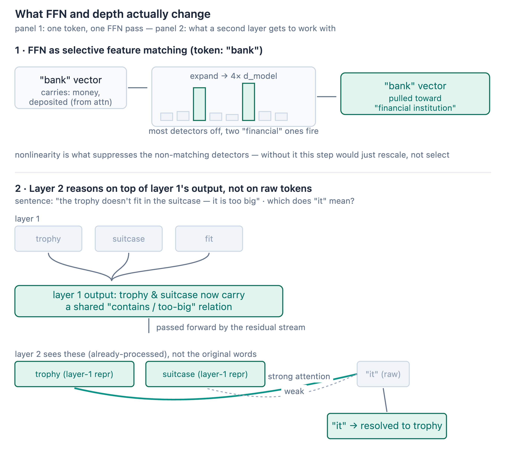
<p>Figure 11: FFN and Layer_depth diagram</p>
</div>
- **Final output**

  The model's last layer outputs logits, not yet a probability distribution — softmax is needed to convert them. There are two reasons for this, both necessary:

  First, if only the highest-probability token (argmax) were output, a lot of information would be discarded — the model's confidence in, say, the second-most-likely token would be completely invisible.

  Second, and more fundamentally: the cross-entropy loss used in training needs gradients with respect to the probability over the entire vocabulary, and argmax is non-differentiable — it simply can't be backpropagated through. Only after converting to a softmax probability distribution can the loss function produce a gradient signal for every logit.

  This is also why temperature and top-p sampling at inference time (which you implemented yourself in `decoding.py`) both require the full probability distribution — both strategies need to see the shape of the entire distribution, not just the single highest value.

##### 2.2.4 Construction

Preparation has already explained why each component is designed the way it is. Construction's job is only to show the order and wiring by which these components are assembled into a complete model — the focus is on structure and how shapes flow, not on re-explaining the mechanisms themselves. The whole process maps naturally onto three steps, corresponding to your three levels of classes, from smallest to largest.

- **Step 1: TransformerBlock — wiring four components into one layer**

  TransformerBlock's input and output share the same shape,**(batch_size, context_length, d_model)** — it never changes the number of tokens or each token's vector dimension, only reworks the content of that vector.

  The internal wiring is a fixed two-stage pattern, and both stages normalize before entering the sublayer (pre-norm), then add the sublayer's output back to the original input (residual):
  $$
  x′=x+Attention(RMSNorm1(x))
  $$
  The first stage handles the attention sublayer: the input $x$ is first normalized by `norm1`, then passed into causal multi-head self-attention for information exchange, and the exchanged result is added back to the original $x$ via the residual connection, giving the intermediate result $x′$ .The second stage is structurally symmetric, just with the sublayer swapped for FFN (SwiGLU): $x′$ is normalized by `norm2`, passed into the FFN for nonlinear processing, and the result is added back to $x′$ via the residual connection to produce this layer's final output.

  The two norms here are not the same instance — they're independent `RMSnorm` parameters, corresponding to the two separate rescaling steps Preparation described: one before entering attention, one before entering the FFN. Each learns its own gain parameter, with no sharing between them.

- **Step 2: TransformerLM body — stacking the same block via a loop**

  This step's input is the raw token_ids, shape **(batch_size, context_length)**. The first thing that happens is an Embedding lookup, turning it into **(batch_size, context_length, d_model)** — the details of this step were already covered in Preparation's embedding subsection and its accompanying diagram; here it's simply the output being carried forward.

  After that comes an explicit loop: the TransformerBlock assembled in Step 1 is instantiated `num_layers` times and stored in an `nn.ModuleList`, and at forward time each layer is called in sequence — each layer's output becomes directly the next layer's input. Throughout this stacking, the tensor shape stays fixed at **(batch_size, context_length, d_model)**— what changes is only the information carried inside the vectors, not their shape. This echoes exactly what the earlier "FFN and layer depth" section argued: going deeper doesn't change shape or dimension, it deepens the level of abstraction at which information is organized.

- **Step 3: Output head — from hidden states to logits**

  After Step 2's stacking, what comes out is still a hidden state of shape **(batch_size, context_length, d_model)**— not yet usable as a prediction. This step first applies `ln_final` for one final rescaling — echoing the principle from Preparation that scale needs to be recalibrated before entering the next "big transformation," which here is the upcoming output projection.

  After that recalibration, the result is passed into `lm_head` (a Linear layer) for a dimension projection, turning the last dimension from dmodeld_{\text{model}} dmodel into **vocab_size**, giving logits of shape **(batch_size,context_length,vocab_size).** The output here is logits rather than a probability distribution, for the reasons already argued in Preparation's "final output" subsection (the full distribution is needed for cross-entropy gradients, and later for temperature/top-p sampling) — Construction here is only marking the exact step where these logits are produced.

## 3. Optimizer

